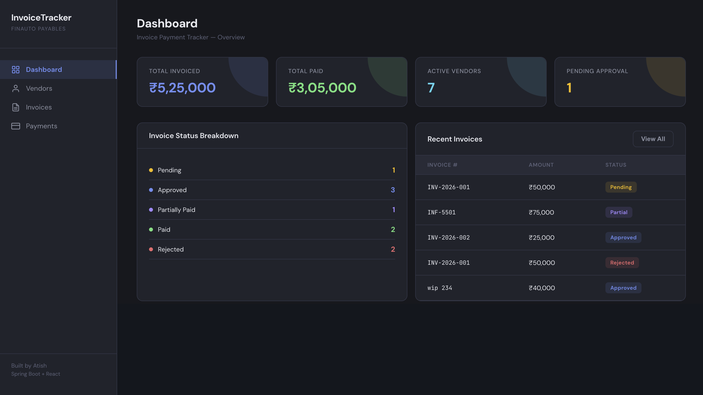
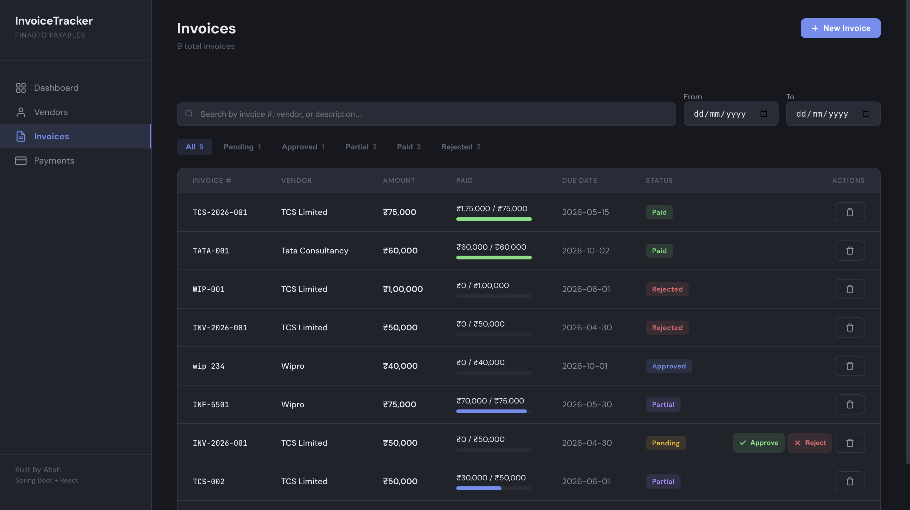
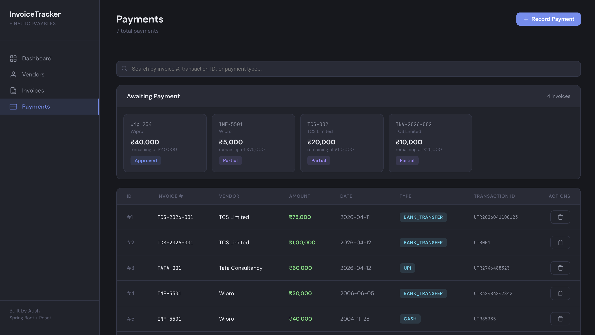
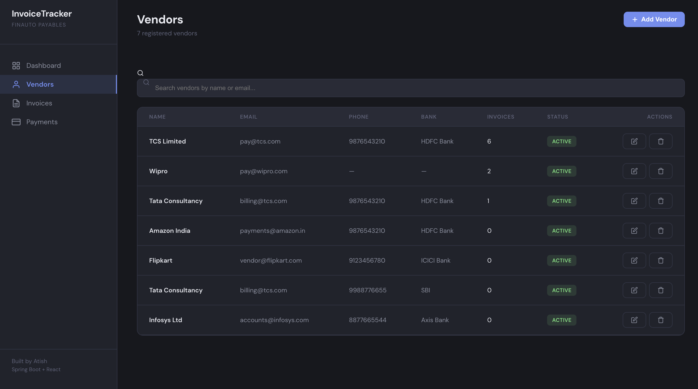

# Invoice Payment Tracker

A full-stack invoice management system built with **Spring Boot 3** and **React**, featuring an approval workflow, partial payment tracking, and real-time status management. Designed to simulate a real-world accounts payable pipeline — invoices flow through review, approval, and settlement stages before being marked as paid.

Built as a learning project for backend engineering with Java/Spring Boot, targeting enterprise-grade patterns used in fintech systems.

---

## Screenshots

### Dashboard


### Invoices — Approval Workflow & Status Filtering


### Payments — Partial Payment Tracking


### Vendors — CRUD & Search


---

## Features

### Invoice Lifecycle
- **Approval Workflow** — Invoices follow a `PENDING → APPROVED → PAID` flow with dedicated approve/reject endpoints
- **Partial Payments** — Track payments against invoices incrementally; status auto-updates to `PARTIALLY_PAID` until fully settled
- **State Validation** — Only PENDING invoices can be approved/rejected; only APPROVED or PARTIALLY_PAID invoices can receive payments

### API Capabilities
- Full CRUD for Vendors, Invoices, and Payments
- Search vendors by name (case-insensitive partial match)
- Filter invoices by date range and amount range
- Custom query methods auto-generated by Spring Data JPA
- Input validation with Jakarta Bean Validation (`@NotBlank`, `@Positive`, `@Email`)
- Centralized error handling with custom exceptions and appropriate HTTP status codes

### Frontend
- Dark-themed React dashboard with sidebar navigation
- Real-time status filtering with tab-based controls
- Payment progress bars showing paid vs. total amount per invoice
- "Awaiting Payment" cards highlighting invoices ready for settlement
- Modal forms for creating vendors, invoices, and recording payments
- Client-side search and date/amount filtering

---

## Tech Stack

| Layer      | Technology                              |
|------------|-----------------------------------------|
| Backend    | Java 21, Spring Boot 3.5, Spring Data JPA |
| Database   | PostgreSQL 16                           |
| Frontend   | React 18                                |
| Validation | Jakarta Bean Validation                 |
| Build Tool | Maven                                   |

---

## Architecture

```
┌─────────────┐     HTTP/JSON     ┌──────────────────────────────┐
│  React App  │ ◄──────────────► │  Spring Boot REST API        │
│  (port 3000)│                   │  (port 8080)                 │
└─────────────┘                   │                              │
                                  │  Controller → Service → Repo │
                                  │                              │
                                  │  GlobalExceptionHandler      │
                                  │  CorsConfig                  │
                                  └──────────────┬───────────────┘
                                                 │ JPA/Hibernate
                                                 ▼
                                          ┌──────────────┐
                                          │  PostgreSQL   │
                                          │  (port 5432)  │
                                          └──────────────┘
```

### Project Structure

```
src/main/java/com/atish/invoicetracker/
├── InvoicetrackerApplication.java       # Entry point
├── Vendor.java                          # Entity
├── VendorRepository.java                # JPA Repository + search query
├── VendorService.java                   # Business logic
├── VendorController.java                # REST endpoints
├── Invoice.java                         # Entity with @ManyToOne → Vendor
├── InvoiceStatus.java                   # Enum: PENDING, APPROVED, REJECTED, PARTIALLY_PAID, PAID
├── InvoiceRepository.java               # JPA Repository + custom queries
├── InvoiceService.java                  # Approval workflow + state validation
├── InvoiceController.java               # REST endpoints + filtering
├── Payment.java                         # Entity with @ManyToOne → Invoice
├── PaymentRepository.java               # JPA Repository
├── PaymentService.java                  # Partial payment logic
├── PaymentController.java               # REST endpoints
├── GlobalExceptionHandler.java          # @RestControllerAdvice
├── CorsConfig.java                      # CORS for frontend
├── InvoiceNotFoundException.java        # 404
├── VendorNotFoundException.java         # 404
├── PaymentNotFoundException.java        # 404
├── InvalidInvoiceStateException.java    # 400
└── VendorHasInvoicesException.java      # 409
```

---

## API Reference

### Vendors `/api/vendors`

| Method | Endpoint               | Description             |
|--------|------------------------|-------------------------|
| GET    | `/api/vendors`         | List all vendors        |
| GET    | `/api/vendors/{id}`    | Get vendor by ID        |
| GET    | `/api/vendors/search?name=` | Search by name (partial, case-insensitive) |
| POST   | `/api/vendors`         | Create vendor           |
| PUT    | `/api/vendors/{id}`    | Update vendor           |
| DELETE | `/api/vendors/{id}`    | Delete vendor (blocked if has invoices) |

### Invoices `/api/invoices`

| Method | Endpoint                         | Description                     |
|--------|----------------------------------|---------------------------------|
| GET    | `/api/invoices`                  | List all invoices               |
| GET    | `/api/invoices/{id}`             | Get invoice by ID               |
| GET    | `/api/invoices/vendor/{vendorId}`| Get invoices by vendor          |
| GET    | `/api/invoices/status/{status}`  | Get invoices by status          |
| GET    | `/api/invoices/filter/date?startDate=&endDate=` | Filter by due date range |
| GET    | `/api/invoices/filter/amount?start=&end=`       | Filter by amount range   |
| POST   | `/api/invoices`                  | Create invoice (status: PENDING)|
| PUT    | `/api/invoices/{id}`             | Update invoice                  |
| PUT    | `/api/invoices/{id}/approve`     | Approve (PENDING → APPROVED)    |
| PUT    | `/api/invoices/{id}/reject`      | Reject (PENDING → REJECTED)     |
| DELETE | `/api/invoices/{id}`             | Delete invoice                  |

### Payments `/api/payments`

| Method | Endpoint                            | Description                        |
|--------|-------------------------------------|------------------------------------|
| GET    | `/api/payments`                     | List all payments                  |
| GET    | `/api/payments/{id}`                | Get payment by ID                  |
| GET    | `/api/payments/invoice/{invoiceId}` | Get payments by invoice            |
| POST   | `/api/payments`                     | Create payment (auto-updates invoice status) |
| PUT    | `/api/payments/{id}`                | Update payment                     |
| DELETE | `/api/payments/{id}`                | Delete payment                     |

### Status Flow

```
          ┌──────────┐
          │ PENDING  │
          └────┬─────┘
         ┌─────┴──────┐
         ▼            ▼
   ┌──────────┐  ┌──────────┐
   │ APPROVED │  │ REJECTED │
   └────┬─────┘  └──────────┘
        ▼
  ┌───────────────┐
  │PARTIALLY_PAID │ ◄── payment < invoice amount
  └───────┬───────┘
          ▼
     ┌─────────┐
     │  PAID   │ ◄── total payments ≥ invoice amount
     └─────────┘
```

---

## Setup & Installation

### Prerequisites
- Java 21 (JDK)
- PostgreSQL 16
- Node.js (for frontend)
- Maven

### 1. Clone the repository
```bash
git clone https://github.com/YOUR_USERNAME/invoice-payment-tracker.git
cd invoice-payment-tracker
```

### 2. Set up the database
```bash
# Start PostgreSQL and create the database
psql -U postgres
CREATE DATABASE invoice_tracker;
\q
```

### 3. Configure database connection
Edit `src/main/resources/application.properties`:
```properties
spring.datasource.url=jdbc:postgresql://localhost:5432/invoice_tracker
spring.datasource.username=YOUR_USERNAME
spring.datasource.password=YOUR_PASSWORD
spring.jpa.hibernate.ddl-auto=update
spring.jpa.show-sql=true
```

### 4. Run the backend
```bash
./mvnw spring-boot:run
```
The API starts at `http://localhost:8080`

### 5. Run the frontend
```bash
cd invoice-tracker-frontend
npm install
npm start
```
The dashboard opens at `http://localhost:3000`

### 6. Seed test data (optional)
```bash
# Create a vendor
curl -X POST http://localhost:8080/api/vendors \
  -H "Content-Type: application/json" \
  -d '{"name":"Acme Corp","email":"billing@acme.com"}'

# Create an invoice
curl -X POST http://localhost:8080/api/invoices \
  -H "Content-Type: application/json" \
  -d '{"vendor":{"id":1},"invoiceNumber":"INV-001","amount":50000,"dueDate":"2026-05-01"}'

# Approve it
curl -X PUT http://localhost:8080/api/invoices/1/approve

# Make a partial payment
curl -X POST http://localhost:8080/api/payments \
  -H "Content-Type: application/json" \
  -d '{"invoice":{"id":1},"paymentAmount":30000,"paymentDate":"2026-04-13","paymentType":"UPI","transactionId":"TXN-001"}'
```

---

## Error Handling

All exceptions are handled centrally via `@RestControllerAdvice`:

| Exception                      | HTTP Status | When                                      |
|--------------------------------|-------------|-------------------------------------------|
| `VendorNotFoundException`      | 404         | Vendor ID doesn't exist                   |
| `InvoiceNotFoundException`     | 404         | Invoice ID doesn't exist                  |
| `PaymentNotFoundException`     | 404         | Payment ID doesn't exist                  |
| `InvalidInvoiceStateException` | 400         | Action not allowed for current status      |
| `VendorHasInvoicesException`   | 409         | Deleting vendor with linked invoices       |
| `MethodArgumentNotValidException` | 400      | Validation failures (@NotBlank, @Positive) |

---

## What I Learned

This project was built over 5 days as a hands-on deep dive into Spring Boot, starting from zero web framework experience. Key concepts covered:

- **Spring Boot 3-layer architecture** — Controller → Service → Repository → Entity
- **Dependency Injection** — constructor-based injection managed by Spring
- **JPA & Hibernate** — entity mapping, relationships (`@ManyToOne`), auto-generated queries
- **REST API design** — resource-based URLs, proper HTTP methods and status codes
- **Validation** — Jakarta Bean Validation with `@Valid` and custom error responses
- **Exception handling** — custom RuntimeExceptions with `@RestControllerAdvice`
- **Business logic** — state machines (approval workflow), running totals (partial payments)
- **Enum-based status management** — compile-time safety with `@Enumerated(EnumType.STRING)`
- **CORS configuration** — enabling cross-origin requests for frontend-backend separation

---

## License

This project is open source and available under the [MIT License](LICENSE).
